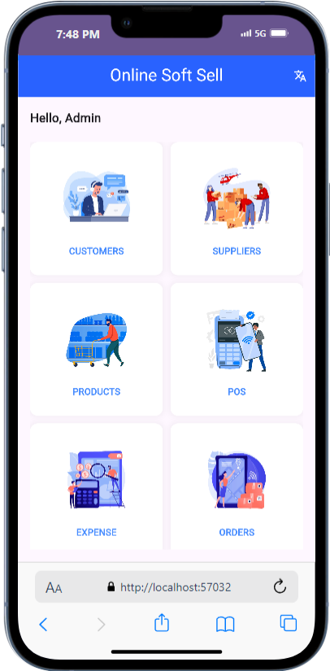
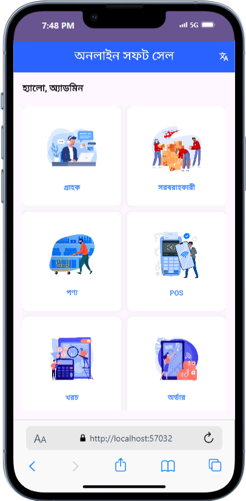

# Mobile Dashboard UI (Design Only)

This repository/project is the second Mobile App Developement Assignment by EDGE Digital Skills Training Program, Batch CBI-018 under our Instructor Noor Mohammad Anik Sir.

The Mobile App displays a dashboard displaying 6 cards, each card represents a section of the app's functionality, although **no** functionality has been added yet (as per the assignment)

The **only** functionality, I've made in this project is the **translator button** (English and Bangla)

## Tools and Languages
Flutter and Dart

## Screenshots (Chrome Extension: Mobile Emulator)
1. **English**

2. **Bangla**

